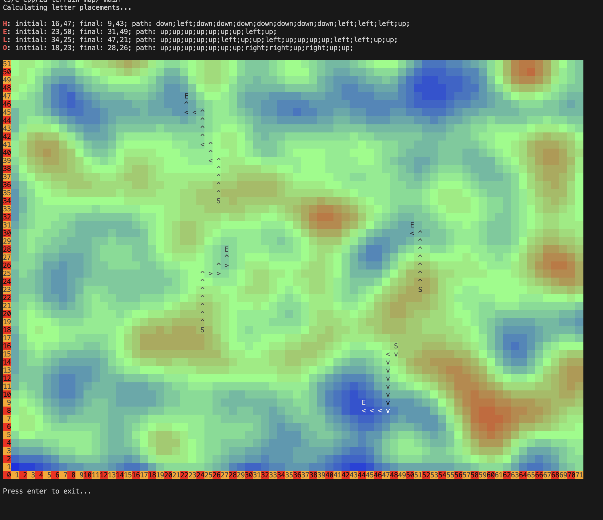

<!-- Cover picture -->

<!-- Explanation -->
# [**`C++`**]()
> Basic C++ programs for simulating the gravity effect on the objects in the given terrain. 

> The idea is to simulate the gravity effect on the objects in the given terrain. The terrain is represented by a 2D array where the value of each cell is the height of the terrain. The objects are represented by a 2D array where each cell is the mass of the object. The gravity effect is simulated by moving the objects down by one cell at each time step. The objects are not allowed to move through the terrain. If an object is at the lowest level of the terrain, it will stay there. If an object is at the same level as the terrain, it will move down by one cell. If an object is at a higher level than the terrain, it will fall down until it reaches the terrain. The simulation stops when all objects have reached the lowest level of the terrain. The program will read the terrain and the objects from a file. The program will print the terrain and the objects at each time step. The program will also print the number of time steps required for all objects to reach the lowest level of the terrain.